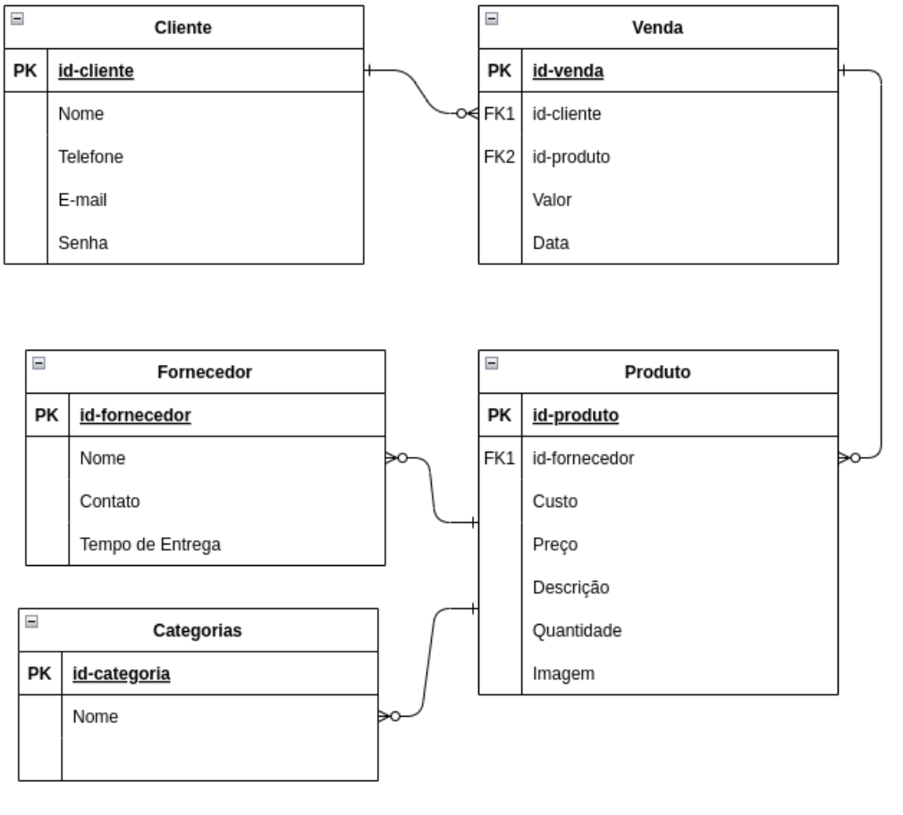

# SiProfePets
Site de compras de produtos para animais em Django feito para o projeto final da disciplina de Bancos de Dados (jan 2022 - maio 2022) da Poli-USP.

Baseado no [tutorial GeeksForGeeks de e-commerce em Django](https://www.geeksforgeeks.org/e-commerce-website-using-django/?ref=lbp).

## Objetivo
Pôr em prática conhecimentos de gerenciamento de bancos de dados, utilizando uma interface simples.

## Modelagem do banco de dados



## Funções do banco de dados disponíveis no site

* Busca produtos por categoria

* Busca quantidades por produtos

* Busca cliente por email

* Busca senha por cliente

* Busca cliente por id

* Cadastra novos clientes

* Cadastra novos pedidos

* Altera quantidade de produtos comprados


## Passos Iniciais
Para rodar esse projeto no seu computador:
1.  Inicialize um [ambiente virtual](https://developer.mozilla.org/en-US/docs/Learn/Server-side/Django/development_environment) em Python.
2.  Rode os comandos (se estiver no Windows você deve usar  ```py``` ou ```py-3``` em vez de ```python3``` para iniciar o Python):
```
pip3 install -r requirements.txt
python3 manage.py makemigrations
python3 manage.py migrate
```
3. Para rodar o site use:
```
python3 manage.py runserver
```
